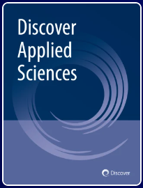
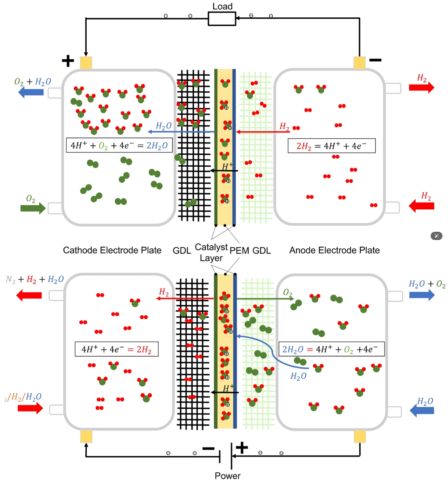

## 👋 Hello there! I'm **Ruyi Wang (王濡翼)**

> *"Coding is poetry; debugging is war."*

A passionate researcher dedicated to rescuing the **PEM water electrolysis system** from the invisible threat of **ion contamination**.

Academically born and raised at **Tongji University**, where I earned both my **Bachelor's** and **Master's** degrees in the **School of Automotive Studies**.

Currently conducting research under the mentorship of **Prof. Xuezhe Wei**, at the **Electrochemical Digital Power Research Lab**, with a focus on intelligent diagnostics for electrochemical energy systems.

---

### 🧠 Research Interests
- Intelligent fault diagnosis for **PEM water electrolysis systems**, with a special focus on **ion poisoning detection**
- Cross-domain method transfer between **PEM fuel cells** and **electrolyzers**
- Physics-informed and data-driven approaches for **impedance analysis** and **voltage prediction**

📄 **First-author Publication**  
> **A Review of Portability of Fault Diagnosis Methods from PEM Fuel Cells to PEM Water Electrolyzers**

  
  
  

> 🔗 [Springer Link](https://link.springer.com/article/10.1007/s42452-025-07318-1)

---

### 🛠️ Technical Stack
- **Languages & Frameworks**: Python / PyTorch / NumPy / Matplotlib  
- **Core Competencies**:  
  - Impedance spectrum modeling and parameter fitting  
  - Transformer-based architectures for fault classification  
  - Multi-task learning: ion type diagnosis + physical voltage prediction  

> *“It’s not overfitting, it’s overthinking — by your model.”*

---

### 🧪 Currently Working On
- Upgrading papers from *"readable"* to *"publishable"*  
- Turning models from *"runs without error"* to *"actually converges"*  
- Exploring **diffusion models** and **domain adaptation** for electrochemical diagnostics

---

### 📬 Contact Me
I’m always open to collaboration, academic exchange, or just a good chat about your model's loss function:
- 📧 **Email**: 2333059@tongji.edu.cn  
- 💬 **QQ**: 975967579  
- 📱 **WeChat**: 15149059192  

---

> _“May your debugging take 30 minutes, and your convergence last all day.”_

